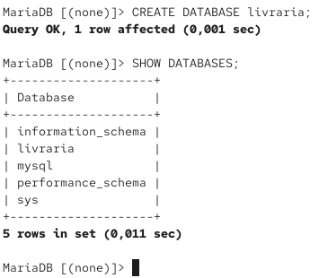
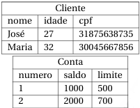
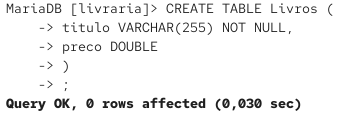
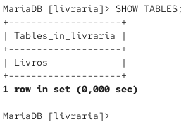

# CAPÍTULO 1: INTRODUÇÃO

## 🎯 SGBD (Sistemas Gerenciadores de Banco de Dados)
Sistemas especializados na persistência de dados que oferecem recursos mais sofisticados e eficientes. Um sistema gerenciador de banco de dados é capaz de gerenciar informações de diversos sistemas ao mesmo tempo.

- Lista de SGBDs mais utilizados:
  - MySQL Server
  - Oracle Database
  - SQL Server
  - MariaDB
  - PostgreSQL

## MariaDB Server
Nossa parte prática será realizada em um **sistema operacional baseado em Linux**, utilizando como SGBD o MariaDB Server, essa ferramenta de banco de dados é capaz de:
- Criar tabelas
- Inserir e consultar dados
- Manipular informações usando comandos SQL

## Bases de dados (Databases)
É um agrupamento lógico das informações de um determinado domínio.

## Criando uma base de dados no MariaDB Server
Assim, podemos executar consultas básicas em um ambiente Linux. 

```
# CREATE DATABASE livraria;
```

Agora, iremos utilizar **SHOW DATABASES** para listar as bases de dados existentes.



Quando uma base de dados não é mais necessária, ela pode ser removida com **DROP DATABASE**.

```
# DROP DATABASE livraria;
```

## Tabelas
Um servidor de banco de dados é dividido em bases de dados com o intuito de separar as informações de domínios diferentes. Nessa mesma linha de raciocínio, podemos dividir os dados de uma base a fim de agrupá-los segundo as suas correlações. Essa separação é feita através de **tabelas**. Por exemplo, no sistema de um banco, é interessante separar o saldo e o limite de uma conta, do nome e CPF de um cliente. Então, poderíamos criar uma tabela para os dados relacionados às contas e outra para os dados relacionados aos clientes.



Uma tabela é formada por **registros** (linhas) e os registros são formados por **campos** (colunas).

## Tabelas no MariaDB Server
As tabelas no MariaDB Server são criadas através do comando **CREATE TABLE**. Na criação de uma tabela, é necessário definir quais são os nomes e os tipos das colunas.

#### Passo 1 - Selecionar a base de dados

```
MariaDB[(none)]> USE livraria;
```

#### Passo 2 - Criando a tabela



```
MariaDB [livraria]> CREATE TABLE Livros (
    -> titulo VARCHAR(255) NOT NULL,
    -> preco DOUBLE
    -> );
```

As tabelas de uma base de dados podem ser listadas através do comando **SHOW TABLES**, antes de usar esse comando, devemos selecionar a base de dados utilizando o comando **USE**.



Se a tabela não for mais desejada, ela pode ser removida através do comando **DROP TABLE**.

Também podemos alterar a estrutura de uma tabela com o comando **ALTER TABLE**, abaixo um exemplo:


- Alterando o nome da tabela:
```
MariaDB [livraria]> ALTER TABLE Livro RENAME Livros;
```
- Adicionando uma coluna:
```
MariaDB [livraria]> ALTER TABLE Livros ADD paginas INTEGER;
```
- Excluindo uma coluna:
```
MariaDB [livraria]> ALTER TABLE Livros DROP COLUMN paginas;
```

## CRUD


## Links:
- [Instalação do MariaDB no CentOS](Instalacao-MariaDB.md)

---
📌 Este material é destinado a fins educacionais e introdutórios.

