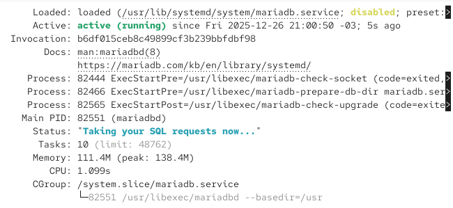
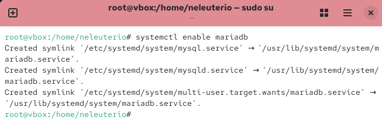

# INSTALAÇÃO DO MARIADB

## Instalação MariaDB no Kali Linux
Sistemas especializados na persistência de dados que oferecem recursos mais sofisticados e eficientes. Um sistema gerenciador de banco de dados é capaz de gerenciar informações de diversos sistemas ao mesmo tempo.

- Lista de SGBDs mais utilizados:
  - MySQL Server
  - Oracle Database
  - SQL Server
  - MariaDB
  - PostgreSQL

## MariaDB Server
Nossa parte prática será realizada em um **sistema operacional baseado em Linux**, utilizando como SGBD o MariaDB Server, essa ferramenta de banco de dados é capaz de:

#### Passo 1 - Instalando o MariaDB

```
$ sudo dnf install mariadb-server
```

ou ...

```
$ sudo yum install mariadb-server
```

Assim que a instalação terminar, inicie o serviço com o ```systemctl```:

```
$ sudo systemctl start mariadb
```

Após isso, verifique o status do serviço:

```
$ sudo systemctl status mariadb
```



Em seguida, vamos usar comando ```systemctl enable``` para conferir se o MariaDB é iniciado ao inicializar o sistema:

```
$ sudo systemctl enable mariadb
```



#### Passo 2 - Protegendo o servidor MariaDB
O MariaDB inclui um script de segurança para alterar algumas das opções padrão menos seguras para os logins de root remotos e usuários de amostra. O comando a seguir executa o script de segurança:

```
$ sudo mariadb-secure-installation
```

Alguns detalhes sobre o script:
- O primeiro passo solicita a senha **root**, que não foi definida ainda. Desta forma, faça como o script recomenda e pressione ```ENTER```.
- Em seguida, será solicitado que você defina a senha root (usuário root do banco de dados).
- Após definir a senha, aceitaremos todas as recomendações de segurança, o que inclui:
  - Remoção de usuários anônimos.
  - Rejeição de login remoto do root.
  - Remoção do banco de dados de teste.
  - Recarregará as tabelas de privilégio.

---
📌 Este material é destinado a fins educacionais e introdutórios.

